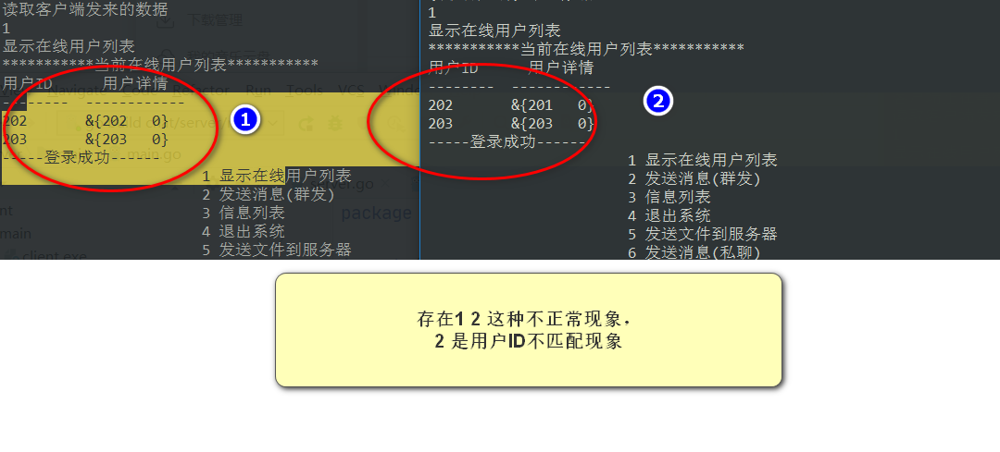

# chat
TCP协程聊天
> 韩顺平视频中的聊天系统，使用了redis,自定义报文协议

### 问题
```
for _, v := range loginResMes.UserIds {
   if v != userId { //不显示当前自己
      fmt.Println("在线用户ID:", v)
      //初始化客户端维护的 在线列表
      user := &message.User{
         UserID:     v,
         UserStatus: message.UserOnLice,
      }
      fmt.Println("--------",userId,user)
      onlineUser[v] = user//TODO 此处导致 查询在线用户不匹配|
   }
}
```



### CTRL+C信号捕获

[https://blog.csdn.net/guyan0319/article/details/90240731](https://blog.csdn.net/guyan0319/article/details/90240731)

### 服务器心跳检测 客户端是还在

服务器发送心跳请求到客户端，如果没有回复则从在线列表中删除该用户(客户端意外退出无法捕获 客户端退出的踪迹，所有从服务端判断)

**服务器有客户端的conn,如果数据发送不出去就是 客户端失去联系，不需要等待客户端回应**

## 启动

```
go build 
```

